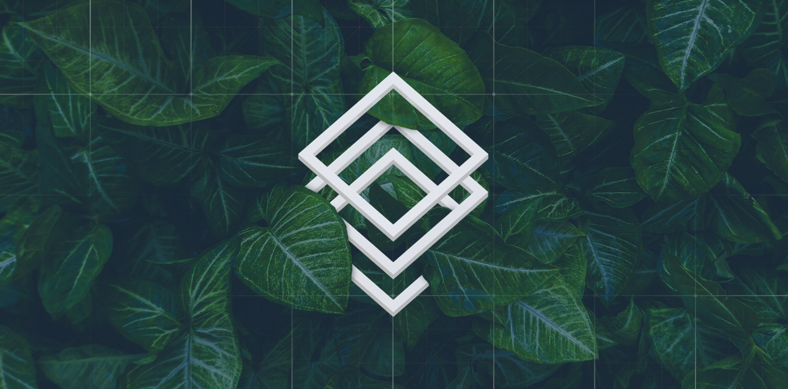

# Code Of Conduct

#### Genesis DAO wide agreements, passed on Alchemy. 

### Mutual Respect and Responsibility / No Sheep - No Shepherds. 

Care less to what you take and much more to what you give.

**Respect People’s differences.** Each of us may approach life and relationship differently. While it may be a challenge for some of us to interact with people who don’t think the way we do, everyone deserves to have his or her feelings and values respected.

**Respect People's trust**. To fund proposals is an act of DAO\`s good faith. All of us are contributing to achieve a common purpose, so one's failure to spend funds properly and productively undermines all the other efforts and community's ambition as a whole. Concentrate on deliverables.

**Respect People’s time.** We are all living under pressure and deadlines. Remember that each of us has a different style of living, so respect your co-workers’ style of time management and prioritizing their workload.

**Respect People's opinion.** Why should I respect other people's opinions if they're just wrong? Because 'being right' is very subjective. We are all different and depending on our social background, education, experience and circumstances. Just because you think you are right does not mean that others are wrong. Stay curious and attentive, try to see life from different positions.

**Respect People's right to be aware.** Discuss your concern before you take actions. Let people know the subject matter of discussion and do it beforehand so to give a reasonable amount of time to enter a dialogue and raise a voice.

[&gt;&gt; See original proposal](https://docs.google.com/document/d/1Ko6jNXh2YcxcUmYL_36ewoLox3uc9oqDL-v6oeZIfis/edit), passed on Oct 23rd 2018 on Genesis Alpha.

#### DAOstack specific agreements 

The following is a code of conduct adopted by DAOstack which is **valid on all DAOstack initiated** and run communications channels. Does **not apply** to activity on Alchemy, reputation, or communications in any groups and channels that are started by people other than DAOstack.

### DAOSTACK COMMUNICATIONS CHANNELS CODE OF CONDUCT \(CoC\) 

**In the interest of fostering an open, safe, and resilient community, as contributors in the Genesis DAO, we pledge to respect all stakeholders related to the Genesis DAO within DAOstack initiated communications channels.**

We refer non-exclusively to the following channels initiated by DAOstack:

* [Genesis DAO Telegram channel](https://www.google.com/url?q=https%3A%2F%2Ft.me%2Fjoinchat%2FICRVPUXV0YNQBqgZAo3i_Q&sa=D&sntz=1&usg=AFQjCNFNho1swyd7b7VwuzEvWepx_ihdCw)
* Telegram working group channels
* [The DAOtalk forum](https://www.google.com/url?q=https%3A%2F%2Fdaotalk.org&sa=D&sntz=1&usg=AFQjCNH04j7GPyNN8BUnF9jSJj1P21_Qgg)
* [Discord](https://www.google.com/url?q=https%3A%2F%2Fdaostack.io%2Fcommunity&sa=D&sntz=1&usg=AFQjCNG7fjuWXIKi1tEIM1XHFqL6SwaP7A)
* Weekly community calls
* Working group calls
* Live events and public spaces
* DAOstack social channels, such as Facebook

We are committed to making participation in this project a harassment-free experience for everyone, regardless of experience level, gender, gender identity and expression, sexual orientation, disability, personal appearance, body size, race, ethnicity, age, religion, or nationality.

Examples of unacceptable behavior by participants include:

* Personal attacks
* Trolling or insulting/derogatory comments. We define Trolling as; passive aggressive language, posting meant to sow discord, posting inflammatory and digressive, extraneous, or off-topic messages, overuse of channels in a way that puts others off from contributing.
* The use of highly sexualized language or imagery
* Public or private harassment
* Publishing other’s private information, such as addresses, without explicit permission; also known as “Doxxing”

Other unethical or unprofessional conduct \(including mis-use of the DAOstack communications channels, mis-use could include but is not limited to; using a channel in a way that does not comply with its purpose, toxic behavior\)

By adopting this CoC, contributors commit themselves to fairly and consistently applying these principles when communicating or representing this project. Contributors who do not follow or enforce the CoC may be permanently removed from the aforementioned communication channels by the moderation, after having received a timely warning.

CoC violations may be reported by contacting a Genesis moderator. At the moment those are @katebee [kate@daostack.io](mailto:kate@daostack.io), @liviade [livia@daostack.io](mailto:livia@daostack.io) and @patdaostack [pat@daostack.io](mailto:pat@daostack.io), however, all members of the Genesis DAO should consider themselves responsible for upholding the CoC and taking action where possible. This is important to help scale moderation as the community grows.

Genesis DAO moderators reserve the right, at their discretion, to remove, edit, or reject posts, comments, and other contributions that violate or are unaligned to this CoC, or to ban temporarily or permanently any contributor for other behaviors that they deem inappropriate, threatening, offensive, or harmful from DAOstack initiated communications channels.

All complaints will be reviewed and investigated by the moderators and will result in a response that is deemed necessary and appropriate to the circumstances. Moderators are obligated to maintain confidentiality with regard to the reporter of an incident unless person is ok with their identity being known.

We take issues with moderation or moderators seriously, if you have an issue with the moderation of this group or with a moderator please do not hesitate to raise this as an issue by doing any of the following:

* Finding a person you trust in the community to talk to
* Approaching one of the other moderators
* Writing a forum post to raise your concerns
* Hosting a breakout room in the community call
* Writing a proposal.

_This CoC is adapted from the_ [_Contributor Covenant_](https://www.google.com/url?q=https%3A%2F%2Fwww.contributor-covenant.org%2F&sa=D&sntz=1&usg=AFQjCNF6KQvo5-niqLTUX1DnlZHXaf2xYQ)_, version 1.3.0, available_ [_here_](https://www.google.com/url?q=https%3A%2F%2Fwww.contributor-covenant.org%2Fversion%2F1%2F3%2F0%2Fcode-of-conduct.html&sa=D&sntz=1&usg=AFQjCNGEbP_VZYJ7jrggs5PPHx_peS0iIA)_._

